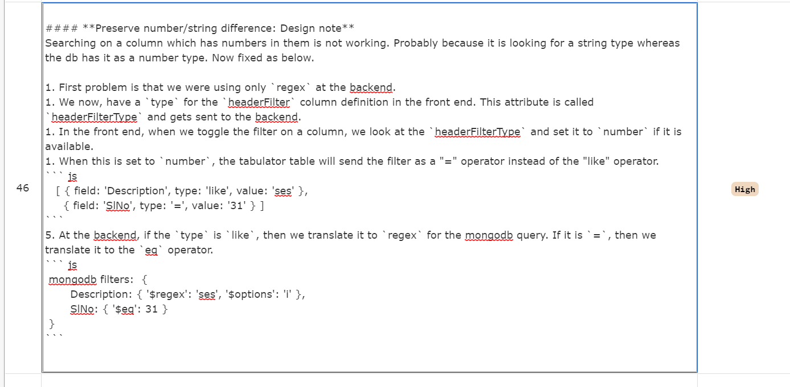
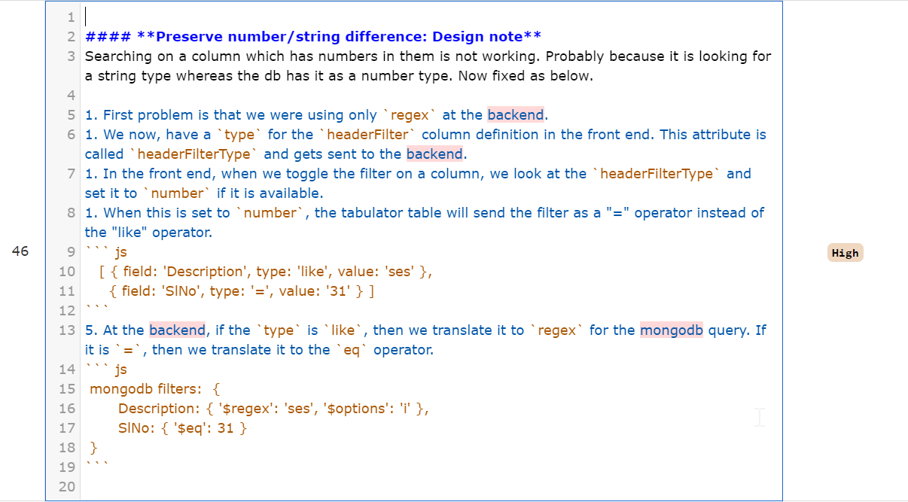
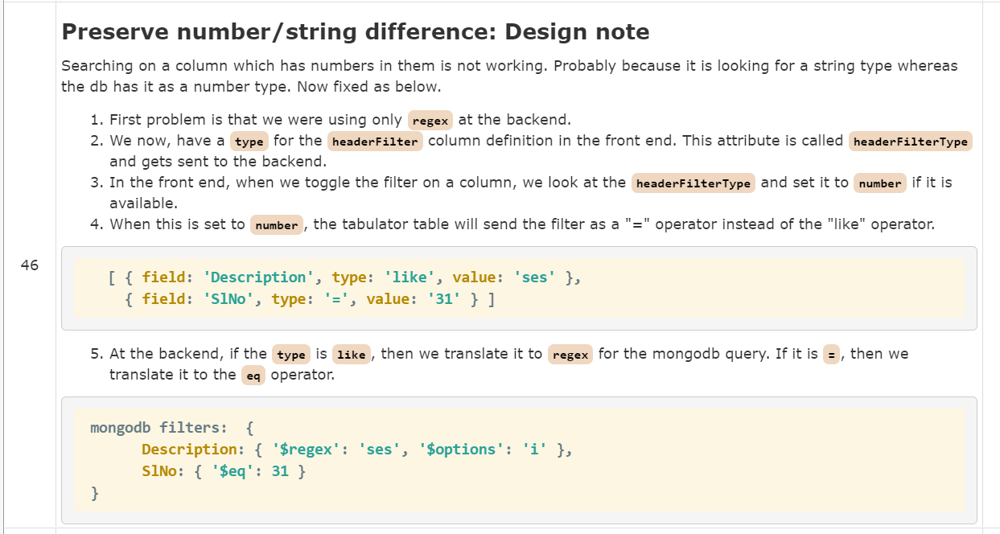
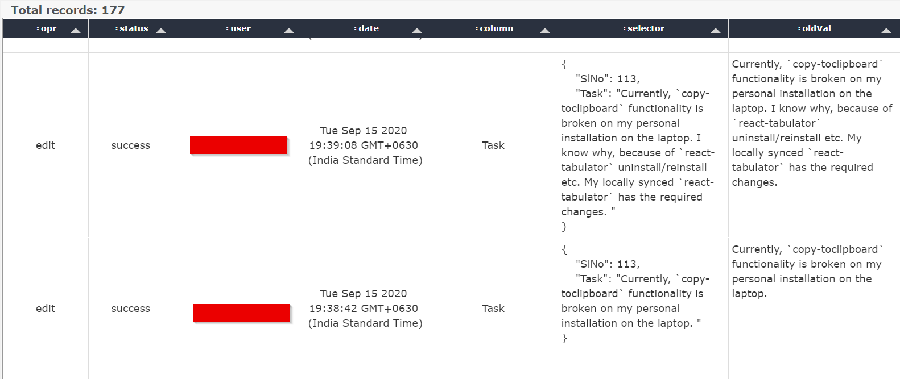

# Datagroom `v0.5`

Datagroom aims to provide tools to maintain and groom arbitrary datasets with a simple and intuitive user-experience. The data grooming can be done by multiple users simultaneously. 

* `datagroom-gateway`: This constitutes the backend of datagroom. 

* `datagroom-ui`: Constitutes the react front-end for it. 

## Features

1. The data is stored in `MongoDb` at the backend. 

1. The front-end features the wonderful `Tabulator` (tabulator.info) component. 

1. Shared editing of data with similar user-experience like a Google sheet. 
    * Per-cell locking.
    * Dynamic updates to edited cells. 
    * Guaranteed to not overwrite a more recent edit by someone else. 

1. Supports markdown in cells. You edit markdown and the html is rendered in the table. Use of `codemirror` as an editor for markdown is enabled. 

1. Export of all data to `xlsx` file format. 

1. Paging, Filtering, Searching (regex), Sorting of data. All from the backend, enabling the tool to work with very large datasets. 

1. Import your data from `xlsx` and `csv` formats. 

1. Adjust and set views that is visible for everyone. 

1. Easy copy of rendered HTML to clipboard. 

1. Configurable single or multiple selection of preset items on a column. 

1. Configurable conditional values for a column based on other column values. 

1. Right-click menu for useful tools. 

1. Per-column editable controls. Also allows you to hide some columns. Set a few formatting attribute on a per column basis. 

1. Edit-log for every single edit by any user. No danger of losing data. 

1. Hook it up to your company's active-directory for user authentication. Or use a single guest user account to start. 

## Uses

1. For quick bug lists, scrum todo lists, personal lists, code notes etc. 

1. Light enough for personal use on a single computer. 

1. Any table-like data that can be shared/edited. 

## Screenshots

1. A sample table once populated:

1. Markdown editing in progress

1. Markdown rendered once editing is done

1. Right-click menu

1. Filters in action

1. Edit-log

